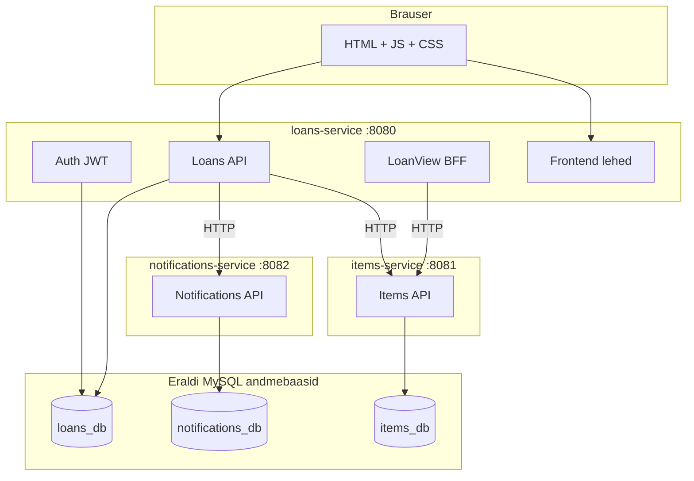
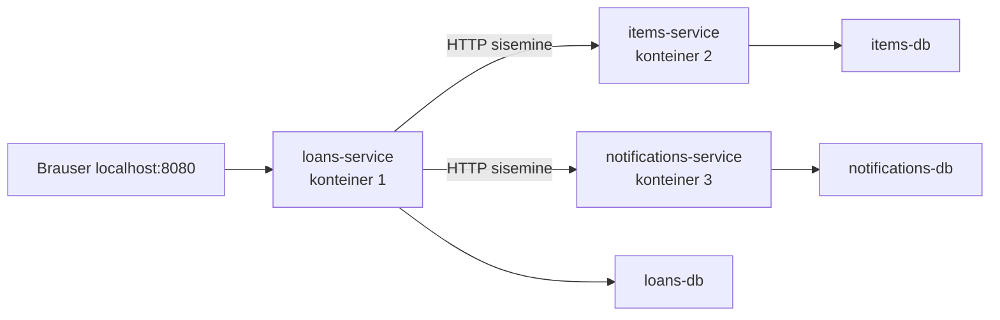
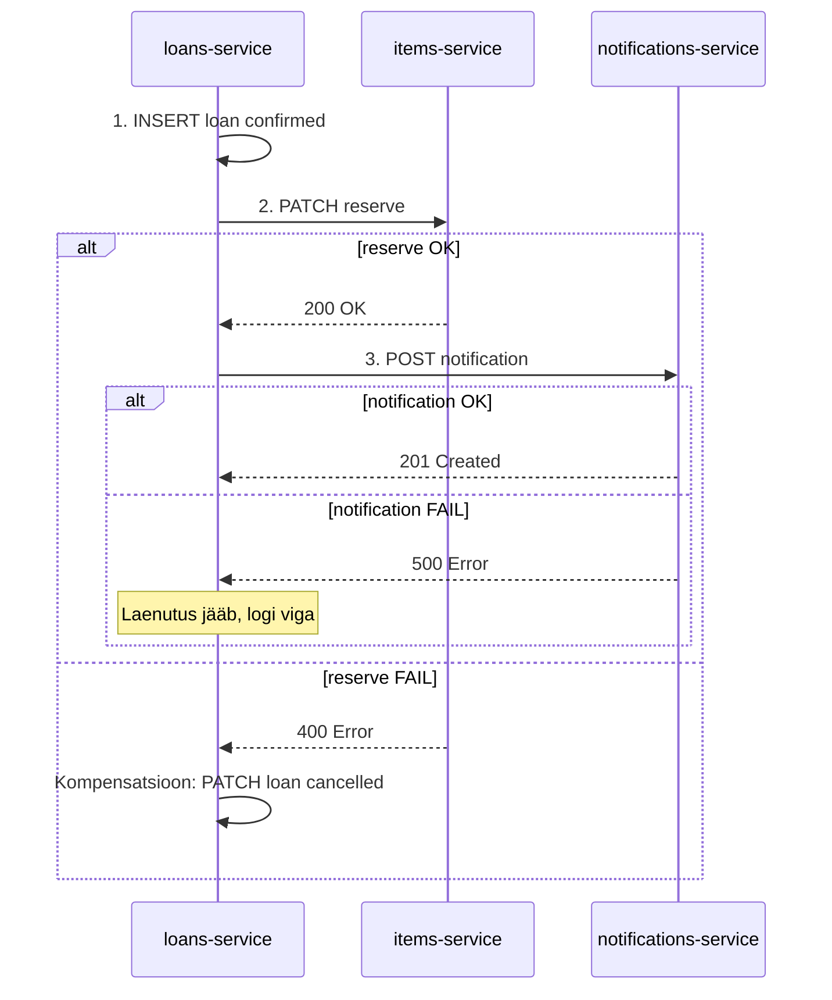

# Laenutus — mikroteenuste valmislahendus

See kaust sisaldab **valmis lahendust**, kus juurkausta monoliit on jagatud **kolmeks mikroteenuseks**. Võiks alustada [monoliidist](../README.md) ja lõhkuda see ise; see kaust on võrdluseks ja kontrollnimekirjaks.

## Käivitamine

```bash
cd lahendus
cp .env.example .env
docker compose up --build
```

Ava brauseris: http://localhost:8080

### Konfiguratsioon

| Fail | Eesmärk |
|------|---------|
| `lahendus/.env` | Docker Compose: `JWT_SECRET`, `MYSQL_ROOT_PASSWORD`, `INTERNAL_API_KEY` |
| `loans-service/.env` | Kohalik PHP ilma Dockerita (vt `loans-service/.env.example`) |
| `items-service/.env` | Kohalik PHP ilma Dockerita (vt `items-service/.env.example`) |
| `notifications-service/.env` | Kohalik PHP ilma Dockerita (vt `notifications-service/.env.example`) |

Docker Compose seadistab iga teenuse andmebaasi muutujad (`DB_HOST`, `DB_NAME` jne) otse `docker-compose.yml` failis — neid pole vaja `lahendus/.env` faili panna. PHP kood loeb alati `DB_HOST` vormingus muutujaid (vt `shared/Database.php`).

## Testkontod

| E-post | Parool | Roll |
|---|---|---|
| student@kool.ee | student123 | user |
| admin@kool.ee | admin123 | admin |

## Arhitektuur



## Miks tundub nagu üks rakendus? (6 Docker konteinerit)

**Kõik ei käivitu ühes konteineris.** Käsk `docker compose up` käivitab **6 eraldi konteinerit**:

| Konteiner | Roll | Väline port |
|-----------|------|-------------|
| `loans-service` | Auth, laenutused, frontend, loan-view | **8080** (brauser avab selle) |
| `items-service` | Vahendite API | 8081 |
| `notifications-service` | Teavituste API | 8082 |
| `loans-db` | users + loans andmebaas | sisemine |
| `items-db` | items andmebaas | sisemine |
| `notifications-db` | notifications andmebaas | sisemine |

Segaduse põhjus: brauser näeb ainult **8080**. `loans-service` on sissepääs — frontend ja API tulevad sealt. Teiste teenustega suhtlemine toimub Dockeri **sisemises võrgus** (`http://items-service`, `http://notifications-service`).



Kontroll:

```bash
docker compose ps                    # näitab 6 konteinerit
curl http://localhost:8081/health    # items eraldi
curl http://localhost:8082/health    # notifications eraldi
```

Pordid 8081 ja 8082 on debugimiseks — tavaline kasutaja kasutab ainult 8080.

**Notifications (8082)** nõuab sisemist API võtit (`X-Internal-Api-Key` päis). Sama võti on `INTERNAL_API_KEY` muutujas nii `loans-service`-is kui `notifications-service`-is. Ilma võtmeta on `/notifications` otspunktid blokeeritud.

## Mis on kompensatsioon?

### Monoliidis — üks transaktsioon

Laenutuse loomisel toimub **üks andmebaasi transaktsioon**:

1. Lisa laenutus
2. Reserveeri vahend
3. Lisa teavitus

Kui samm 3 ebaõnnestub → `rollBack()` → kõik kolm sammu tühistatakse automaatselt.

### Mikroteenustes — kolm eraldi andmebaasi

Igal teenusel on **oma andmebaas**. Ühtset `rollBack()` üle teenuste pole:

1. Loans salvestab laenutuse oma DB-sse ✓
2. Items muudab vahendi `reserved`-ks oma DB-s ✓
3. Notifications loob teavituse oma DB-s ✗ **viga**

Ilma kompensatsioonita jääks olukord **poolikuks** (laenutus loodud, vahend reserveeritud, teavitust pole).

### Kompensatsioon = käsitsi tagasivõtmine

Kui hilisem samm ebaõnnestub, tehakse varasemate sammudega **vastupidine toiming**:

| Samm | Toiming | Kui järgmine samm ebaõnnestub |
|------|---------|-------------------------------|
| 1 | Loo laenutus (`confirmed`) | — |
| 2 | Reserveeri vahend (HTTP PATCH) | **Kompensatsioon:** märgi laenutus `cancelled` |
| 3 | Saada teavitus (HTTP POST) | Laenutus **jääb** — logi viga, proovi hiljem uuesti |



Kompensatsiooni loogika on [`loans-service/src/Loans/LoansService.php`](loans-service/src/Loans/LoansService.php) failis.

## Mis muutus (monoliit → lahendus)

| Aspekt | Monoliit (juurkaust) | Mikroteenused (lahendus/) |
|--------|----------------------|---------------------------|
| Andmebaas | 1 MySQL, 4 tabelit, FK-d | 3 MySQL, 3 tabelit teenuse kohta, FK-d ainult seesama teenuse piires |
| Suhtlus | otsekutsed PHP-s (`new ItemsService()`) | HTTP REST (`HttpClient`) |
| Juurutamine | 2 konteinerit (app + db) | 6 konteinerit (3 app + 3 db) |
| Tehingud | üks DB transaktsioon | kompensatsioon (Saga muster) |
| Sissepääs | üks `index.php` | loans-service (8080) + proxy items API-le |
| Auth | monoliidis | loans-service sees (8080) |

## Mis jäi samaks

| Aspekt | Sama? |
|--------|-------|
| API leping brauserile (`/auth/login`, `/items`, `/loans`, `/loan-view/{id}`) | Jah |
| Veakoodid (`INVALID_DATE_RANGE`, `NOT_FOUND` jne) | Jah |
| JWT autentimine (HS256) | Jah |
| Testkontod | Jah |
| Frontend UI (views, CSS, JS) | Jah |
| Ärireeglid (kuupäevad, staatused, reserveerimine) | Jah |
| Simuleeritud e-kirja saatmine (logi + `sent`) | Jah |

## Teenuste kaardistus

| Monoliidi moodul | Mikroteenus | Port | Andmebaas |
|---|---|---|---|
| `src/Auth/` + `src/Loans/` + `src/LoanView/` + frontend | loans-service | 8080 | loans_db (users, loans) |
| `src/Items/` | items-service | 8081 | items_db (items) |
| `src/Notifications/` | notifications-service | 8082 | notifications_db (notifications) |

## API otspunktid

**Brauseri kaudu (8080):** sama mis monoliidis — `GET /health`, `POST /auth/login`, `GET /items`, `GET/POST/PATCH/DELETE /loans`, `GET /loan-view/{id}`.

**Otse teenustele (debug):**

- Items (8081): `GET /health`, `GET /items`, `GET /items/{id}`, `PATCH /items/{id}` (admin), `POST /items/{id}/reserve`, `POST /items/{id}/release`
- Notifications (8082): `GET /health`, `POST /notifications`, `GET /notifications` (vajab `X-Internal-Api-Key` päist)

## curl näited

```bash
# Tervisekontroll
curl -i http://localhost:8080/health
curl -i http://localhost:8081/health
curl -i http://localhost:8082/health

# Sisselogimine
curl -s -X POST http://localhost:8080/auth/login \
  -H 'Content-Type: application/json' \
  -d '{"email":"student@kool.ee","password":"student123"}'

# Laenutuse vaade (koostaja)
curl -i http://localhost:8080/loan-view/l-100 \
  -H "Authorization: Bearer <token>"

# Notifications (sisemine võti — sama mis lahendus/.env failis INTERNAL_API_KEY)
curl -i http://localhost:8082/notifications \
  -H "X-Internal-Api-Key: muuda-see-sisemiseks-voimeks"
```

## Õpilaste kontrollnimekiri

- [ ] Eraldada items teenus oma andmebaasiga
- [ ] Eraldada notifications teenus oma andmebaasiga
- [ ] Loans teenus kutsub items/notifications HTTP kaudu (mitte otsekutsed)
- [ ] Eemaldatud teenusteülene FK
- [ ] Laenutuse loomisel kompensatsioon, kui reserveerimine ebaõnnestub
- [ ] Docker Compose käivitab mitu teenust
- [ ] Brauseri API leping muutumatu (8080 kaudu)

## Võimalikud laiendused

- Eraldi auth teenus (port 8083)
- Notifications queue-põhiseks (Redis/RabbitMQ)
- API gateway eraldi konteineris
